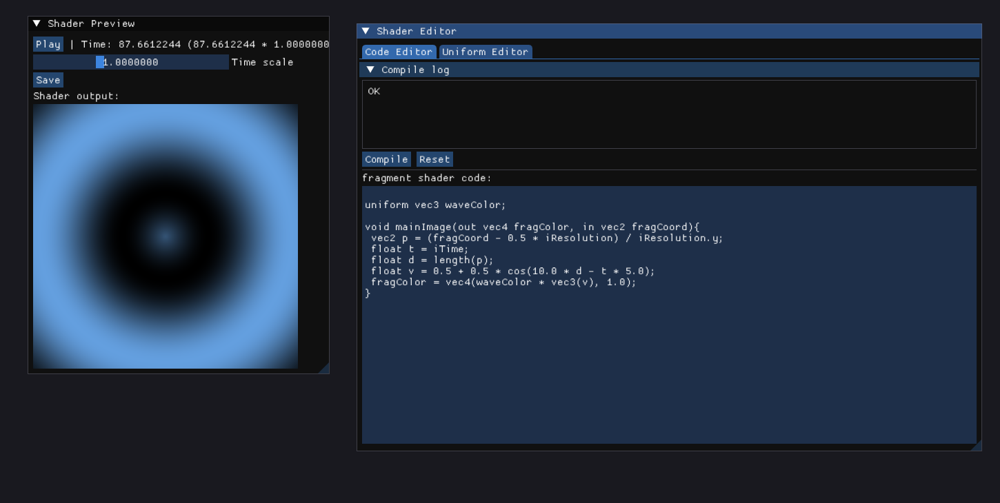
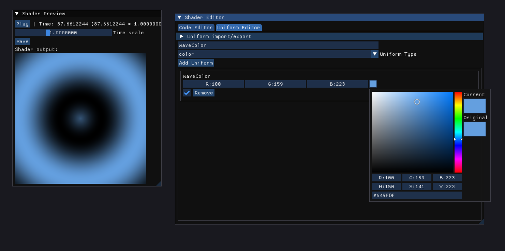

# LiveShader
This is a application for shader write and playing with uniform editor on live time!

# Credit

This Project uses follow libraries.

- [zlib](https://zlib.net/)

- [libpng](https://libpng.sourceforge.io/)

- [nlohmann json](https://github.com/nlohmann/json)

- [glad](https://glad.dav1d.de/)

- [GLFW3](https://github.com/glfw/glfw)

- [ImGui](https://github.com/ocornut/imgui)

- [SDL](https://github.com/libsdl-org/SDL)
